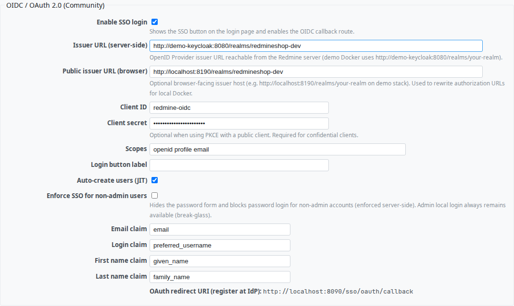
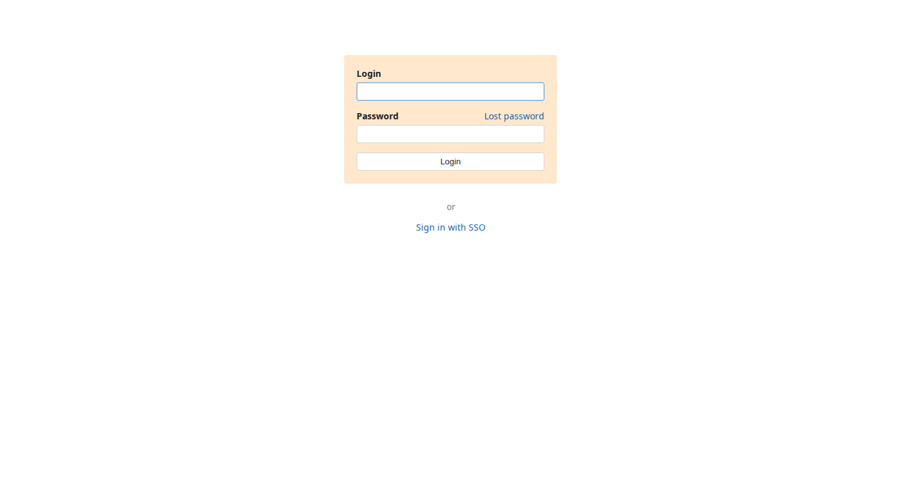
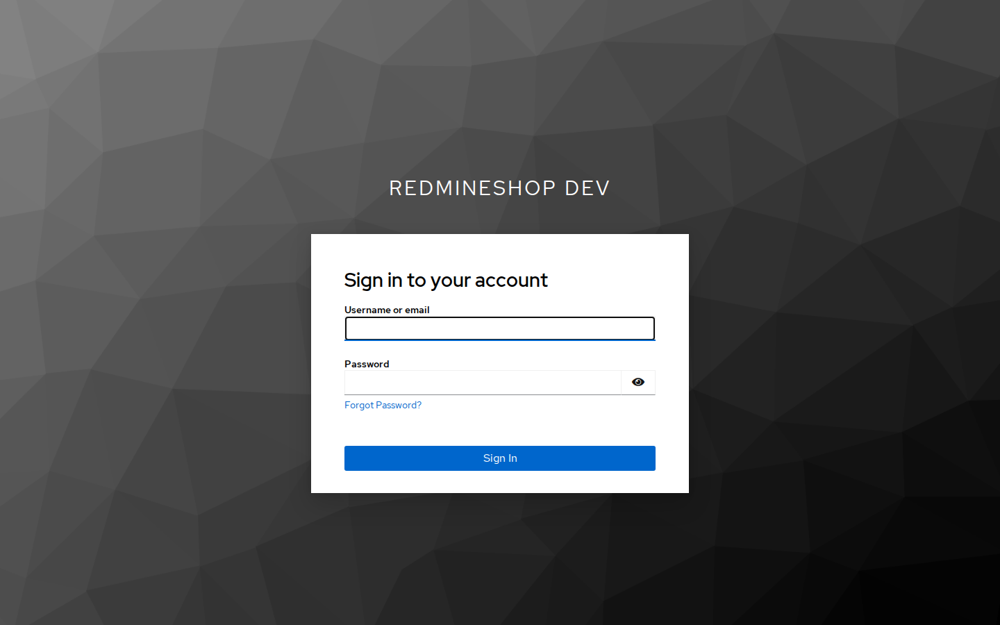
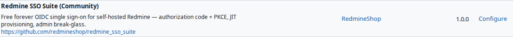

# Redmine SSO Suite — Free OpenID Connect (OIDC) Single Sign-On Plugin for Redmine

[](https://redmineshop.com/products/redmine-sso-suite)
[](LICENSE)
[](https://github.com/redmineshop/redmine_sso_suite/actions/workflows/ci.yml)

**Last maintained:** 2026-09-21

**Source on GitHub:** [github.com/redmineshop/redmine_sso_suite](https://github.com/redmineshop/redmine_sso_suite)

**Redmine SSO Suite** adds OpenID Connect / OAuth 2.0 single sign-on to self-hosted Redmine, so your team logs in with Keycloak, Okta, Azure Entra ID, Google Workspace, or any standards-compliant identity provider instead of a separate Redmine password.

Community edition is **free forever** — no license key, no phone-home, **no email to clone**. Built and maintained by [RedmineShop](https://redmineshop.com). Pro (planned) adds SAML 2.0, multi-IdP, group/role sync, and audit logging. Community features never move behind a paywall.

## Why teams choose this Redmine OIDC plugin

Stock Redmine authentication is username/password only. IT teams that must enforce corporate identity standards (SSO mandate, password rotation policy, offboarding via the IdP) are left bolting on plugins that vary widely in security quality and maintenance. Redmine SSO Suite is a focused, actively maintained OIDC implementation with authorization-code + PKCE, JIT provisioning, and — unlike many community SSO plugins — a real server-side enforcement mode (see [Security](#security) below).

## Features (Community — free forever)

- **OpenID Connect Authorization Code flow with PKCE (S256)** — the flow recommended by the OAuth 2.0 Security Best Current Practice for a confidential/public web client like Redmine
- **Automatic issuer discovery** via `.well-known/openid-configuration` — point it at your IdP realm URL, no manual endpoint entry
- **Just-in-time (JIT) user provisioning** — Redmine accounts are created automatically on first successful SSO login, mapped from configurable claims (email, login, first/last name)
- **"Sign in with SSO" button** injected on the standard Redmine login page via a view hook — no core file changes
- **Enforce SSO for non-admin users** — hide *and* server-side block password login for everyone except administrators
- **Admin break-glass** — administrators can always fall back to local password login, so a misconfigured IdP never locks you out of your own Redmine
- Configurable claim mapping (`email`, `preferred_username`, `given_name`, `family_name`) to match non-standard IdP claim names
- Split server/browser issuer URLs — supports Docker setups where Redmine reaches the IdP over an internal network while browsers use a public hostname

## Security

Single sign-on is the kind of feature where a subtle bug becomes a full account-takeover, so this plugin ships with explicit protections most Redmine OIDC plugins skip:

| Protection | What it prevents |
| --- | --- |
| `back_url` validated with Redmine's own `validate_back_url` (store and use) | Open redirect (CWE-601) via a crafted `/sso/login?back_url=...` link or a tampered session value |
| "Enforce SSO for non-admin" blocks `AccountController#password_authentication` server-side | Bypassing the SSO requirement with a direct `POST /login` once the UI toggle is hidden |
| `email` claim only trusted when the IdP marks it `email_verified` | Account takeover by claiming another user's email on IdPs that allow self-declared/unverified emails |
| ID token `iss` / `aud` / `exp` required (fail closed) and checked on every login | Tokens that omit registered claims, or that were issued for a different issuer, a different OAuth client, or already expired |
| ID token RS256 signature checked when discovery exposes `jwks_uri` | Accepting an unsigned or wrong-key JWT as an ID token |
| OAuth `state` compared with `ActiveSupport::SecurityUtils.secure_compare` | CSRF on the OIDC callback and timing side-channels on the comparison |
| IdP / token errors logged server-side, generic flash on the login page | Reflected XSS or token-endpoint bodies shown to the browser |

Full history in [CHANGELOG.md](CHANGELOG.md). Found a security issue? Please report it privately — see [Support](#support--links) — instead of opening a public GitHub issue.

## Requirements

- Redmine **6.x** (primary target); **5.1.x** targeted — see [compatibility](#compatibility)
- Ruby 3.x (bundled with the official Redmine Docker image)
- MySQL 8 or PostgreSQL
- One OpenID Connect identity provider — Keycloak, Okta, Auth0, Azure Entra ID, Google Workspace, or any OIDC-compliant IdP

## Installation

**Estimated time: 10–15 minutes** (plus IdP client registration).

Clone into `plugins/redmine_sso_suite` in your Redmine install (folder name must match):

```bash
cd /path/to/redmine/plugins
git clone https://github.com/redmineshop/redmine_sso_suite.git
ls redmine_sso_suite/init.rb
```

Do not rename the plugin directory. If you download a GitHub ZIP, rename the unpacked `redmine_sso_suite-main` folder to `redmine_sso_suite`.

This plugin has **no extra gems** and **no database migrations**. Restart Redmine, then go to **Administration → Plugins → Redmine SSO Suite → Configure**.

Register the redirect URI with your identity provider:

```
https://your-redmine.example.com/sso/oauth/callback
```

See the [install guide](https://redmineshop.com/docs/sso-install) for IdP-specific notes.

## Configuration

1. **Administration → Plugins → Redmine SSO Suite → Configure**
2. Check **Enable SSO login**
3. Set **Issuer URL (server-side)** to your IdP realm / tenant issuer (the URL that serves `/.well-known/openid-configuration`)
4. Set **Client ID** and **Client secret** from the IdP
5. Optional: **Public issuer URL** when browsers reach the IdP on a different host than Redmine (Docker / split DNS)
6. Save. The login page shows **Sign in with SSO**.

Administrators can always use the local password form (break-glass), even when **Enforce SSO for non-admin** is on.

## Settings reference

| Setting | Description |
| --- | --- |
| Issuer URL (server-side) | OIDC issuer reachable from the Redmine server |
| Public issuer URL | Browser-facing issuer host, only needed when it differs from the server-side URL |
| Client ID / Client secret | OAuth 2.0 client credentials issued by your IdP |
| Scopes | Space-separated OIDC scopes (default `openid profile email`) |
| Login button label | Custom text for the "Sign in with SSO" button |
| Auto-create users (JIT) | Automatically create a Redmine account on first successful SSO login |
| Enforce SSO for non-admin | Hides the password form and blocks password login for non-admin accounts server-side; administrators always keep local password login (break-glass) |
| Email / login / first name / last name claims | Map your IdP's claim names if they differ from the OIDC defaults |

## Compatibility

| Redmine | Ruby | Database | Status |
|---------|------|----------|--------|
| 6.x     | 3.2+ | MySQL 8 / PostgreSQL | Targeted — **untested** (no published QA matrix) |
| 5.1.x   | 3.1+ | MySQL 8 / PostgreSQL | Targeted — **untested** |

Do not treat catalog versions as tested cells. The demo quality harness is **one** Redmine image, not a 5.1 / 6.x matrix.

## Screenshot

OIDC settings, login SSO button, Keycloak authorize start, and the Administration → Plugins row (demo Redmine):









Screenshot refresh lives in the private `redmineshop/redmineshop` harness. A public clone cannot run it.

## Tests

Unit + functional tests live under `test/` (MiniTest). Run them from a Redmine tree with this plugin in `plugins/redmine_sso_suite`:

```bash
bundle exec rake redmine:plugins:test NAME=redmine_sso_suite RAILS_ENV=test
```

They cover the OIDC client (PKCE, discovery, token/claim validation, fail-closed `iss`/`aud`/`exp`, RS256/JWKS when configured), JIT provisioning (including the `email_verified` guard and non-admin create), the OAuth callback (state validation, session establishment, sanitized IdP errors, tampered `back_url`), and the server-side SSO enforcement patch. Token exchange is **stubbed** in MiniTest — they do not require a live IdP.

Public sibling CI (`.github/workflows/ci.yml`) is Ruby syntax only (`ruby -c`). That is not the quality bar.

### Quality harness (demo + E2E)

E2E lives in the **private** `redmineshop/redmineshop` harness (`docker-compose.demo.yml` + Keycloak + Playwright). This public GitHub repo is the plugin only — it does not ship that compose file, and a public clone cannot open private harness docs.

Install and smoke this plugin on your own Redmine: [SSO install](https://redmineshop.com/docs/sso-install).

| Bar | Status |
| --- | --- |
| Automated tests beyond `ruby -c` | **Verified** — `test/unit` + `test/functional` in this repo (Playwright is a separate row) |
| Installed + enabled on demo Redmine | **Verified** — mounted via `demo/plugins/` on the private monorepo demo stack; seed applies OIDC settings and waits for Keycloak discovery |
| E2E primary happy path | **Verified** — Playwright on that private harness (Configure page, key fields, login SSO button, Keycloak authorize, callback, Redmine session, JIT user `sso.test`) |
| UI screenshot in README | **Verified** — `screenshots/{admin-plugins,plugin-settings,login-sso-button,keycloak-login}.png` from that spec |
| Redmine 5.1 / 6.x matrix | **Declared / untested** — this harness is one demo image, not a QA matrix |

## Local Keycloak demo (private harness)

This GitHub repository is **the plugin**. The Keycloak + Redmine demo stack lives in the **private** `redmineshop/redmineshop` harness (`docker-compose.demo.yml`). It is not part of a `git clone` of this repo.

Playwright there completes the OIDC happy path: SSO button → Keycloak login (`sso.test`) → callback → Redmine session → JIT account. The harness seed sets `Setting.host_name` from `DEMO_URL` (`http://127.0.0.1:8090`) so the OAuth redirect URI and the Playwright cookie host match. MiniTest still stubs token exchange for the cases that do not need a live IdP.

## License

GPL-3.0 — see [LICENSE](LICENSE). Source is public; clone and self-build are always allowed under GPL. No email required to get Community. There is no signed email-funnel package for this plugin.

## Support & Links

- Product page: https://redmineshop.com/products/redmine-sso-suite
- Community vs Pro comparison: https://redmineshop.com/docs/sso-community-vs-pro
- Issues (non-security bugs and feature requests): https://github.com/redmineshop/redmine_sso_suite/issues
- Security reports: support@redmineshop.com
